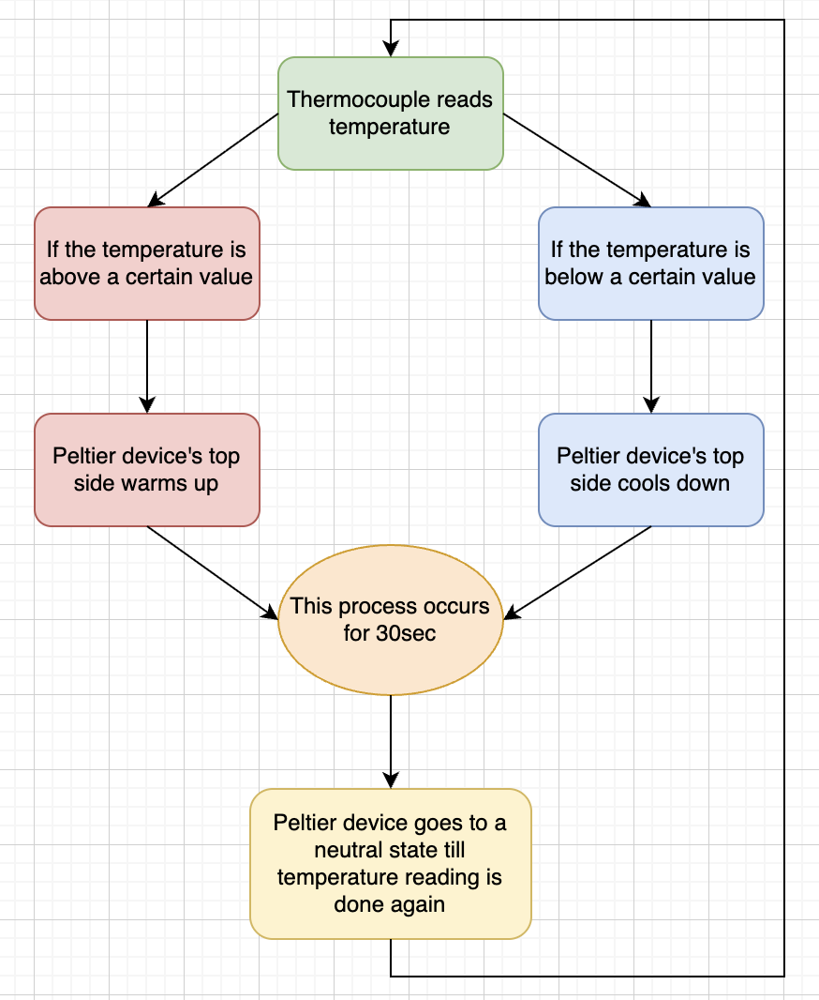
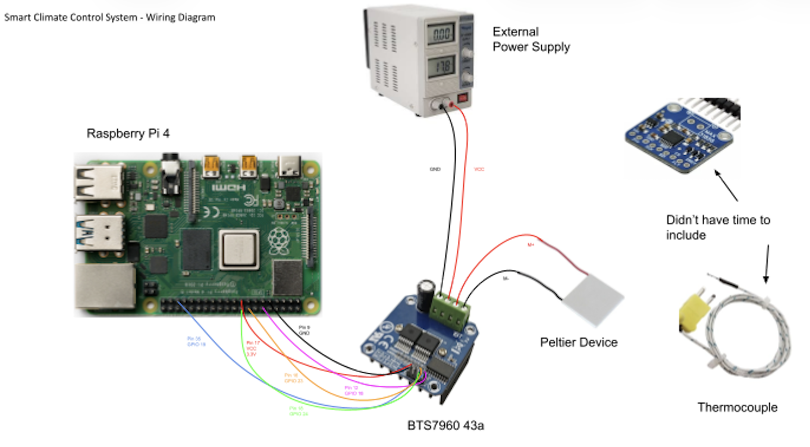

# Smart Climate Control System
Digital Electronics Final Project, Sheen Handoo

## Project Overview
For my final project, I built a Smart Climate Control System using a Raspberry Pi and a thermoelectric Peltier module. It senses temperature, decides whether to heat or cool, and uses power electronics (such as an H-bridge module) to drive the Peltier. Python code controls everything. This demonstrates embedded systems, digital logic, power control, and closed-loop feedback. 
* Digital Notebook: https://docs.google.com/document/d/1hWb3qJW2UgFH1D-iUqKGLdJwvkiZwQifIboyYEuQp94/edit?tab=t.0 
<div align="center">
  
</div>

## Inspiration and Initial Brainstorm
When coming up with a project, I was looking through my weather app for the next day and then I thought to myself, why not make a project based on temperature control. So I went with that idea and came up with a plan of having a fan on one side with a heater on the other of a box-like structure with a temperature sensor in the middle. After consulting others, I realized this idea was too simple, so after research and help from Mr. Marc-Aurele, I was able to decide on using a Peltier device as my main control system and Thermocouples as my temperature sensors.

## Bill Of Materials and Part Descriptions
* Raspberry Pi 4: Main controller of my project
* Peltier devices: Thermoelectric cooling, used in Peltier devices, uses direct current passing through junctions of different conductors to create a temperature difference between two plates, effectively moving heat from a "cool side" to a "hot side." This solid-state method eliminates the need for liquid refrigerants, relying instead on metal conductors and heat sinks to dissipate thermal energy. You can see a visual of it in the image below. (Source 1)
    * 
* Thermocouples: A thermocouple is a temperature sensor made of two dissimilar metals joined at a junction that generates a voltage proportional to the temperature difference between that point and a known "cold junction" reference. Because different metal combinations offer varying sensitivities and ranges—such as the versatile Type K, which is the type I used in my project—careful selection of probe type and insulation is essential for accurate physiological or industrial monitoring (Source 2). I used an amplifier breakout board to measure and see the signals recieved from the thermocouple in order to use it in my code and integrate it into my project.
    * 
* BTS7960 43A (H-Bridge Module used in this project): The BTS 7960 is a compact, high-current motor driver that combines two power switches and an integrated controller into a single package, making it easy to connect directly to a microcontroller. It provides a highly efficient and safe solution for controlling motors by featuring built-in protections against issues like overheating and short circuits, while also reducing electromagnetic interference. (Source 3)
* Breadboard
* Jumper Wires
* Variable Power Supply

## Code Block Diagram
<div align="left">
  
</div>

## Code
The full code for this project can be found in ```testinghi```. This project was fully coded in Python.
I imported two python libraries, which can be found below. The first one allows the code to "talk to the physical world" through the GPIO Pins on the Raspberry Pi. The second one handles time-related tasks, like in my project, it controls for how long the Peltier can heat up/cool down for before changing the flow to make the opposite sides heat up/cool down.
```python
import RPi.GPIO as GPIO  
import time              
```
Next, I defined my PWM Pins and Enable pins. The ```RPWM``` and ```LPWM``` pins control the speed and direction of the BTS7960 motor driver while the ```REN``` and ```LEN``` pins act as safety switches for the motor. After that, I initialized my GPIO pins. The ```GPIO.BCM``` means that I am using Broadcom pin numbering instead of physical pin orders and ```GPIO.OUT``` means it is an output so the Pi will send voltage out of the motor driver.  Since not all Raspberry Pis have the same ```GPIOs``` in the same pins, the ```BCM``` allows it to stick to the specific ```GPIO``` instead of relying on the ```PIN```, which is specific to the Raspberry Pi version used. Then, I initialized my frequency and set it to power on and off 1000 times per second and started my ```lpwm``` and ```rpwm``` with a 0% duty cycle.
```python
RPWM_PIN = 18  # Right PWM (Controls speed/movement in one direction - right)
LPWM_PIN = 19  # Left PWM (Controls speed/movement in the other direction - left)
REN_PIN = 23   # Right Enable (Safety switch for Right side)
LEN_PIN = 24   # Left Enable (Safety switch for Left side)

GPIO.setmode(GPIO.BCM)
GPIO.setup(RPWM_PIN, GPIO.OUT)
GPIO.setup(LPWM_PIN, GPIO.OUT)
GPIO.setup(REN_PIN, GPIO.OUT)
GPIO.setup(LEN_PIN, GPIO.OUT)

frequency = 1000
rpwm = GPIO.PWM(RPWM_PIN, frequency)
lpwm = GPIO.PWM(LPWM_PIN, frequency)
rpwm.start(0)
lpwm.start(0)
```
After that, I defined my two states, ```cool``` and ```heat```.
In the ```cool``` state, I am making current flow from the right side to the left side, making one side cold while the other one warm.
```python
if direction == "cool":
        GPIO.output(REN_PIN, GPIO.HIGH)
        GPIO.output(LEN_PIN, GPIO.LOW)
        rpwm.ChangeDutyCycle(duty_cycle)
        lpwm.ChangeDutyCycle(0)
```
In the ```heat``` state, I am making current flow from the left side to the right side, making the initially cold side warm while the initially warm side cold.
```python
elif direction == "heat":
        GPIO.output(REN_PIN, GPIO.LOW)
        GPIO.output(LEN_PIN, GPIO.HIGH)
        rpwm.ChangeDutyCycle(0)
        lpwm.ChangeDutyCycle(duty_cycle)
```
Finally I am clearing all the pins and making all the voltages go down to ```0V``` making the Peltier turn off completely.
```python
else:
        GPIO.output(REN_PIN, GPIO.LOW)
        GPIO.output(LEN_PIN, GPIO.LOW)
        rpwm.ChangeDutyCycle(0)
        lpwm.ChangeDutyCycle(0)
```
Then, I am calling my function. In the ```cool``` state, using the line ```set_peltier_state("cool", 50)```, I am setting the motor driver to flow "forward" at 50% power and the Peltier gets cold. I am running this code for 20 seconds, specified by the line ```time.sleep(20)```. Next, I am using the ```heat``` mode. With the line ```set_peltier_state("heat", 50)```, I am setting the BTS7960 to flow "backward" at 50% power and the Peltier gets hot. I am running this code for 20 seconds, specified by the line ```time.sleep(20)```. Finally I am clearing all the ```rpwm``` and ```lpwm``` values, making the BTS7960 and therefore also the Peltier stop.
```python
try:
    set_peltier_state("cool", 50)
    time.sleep(20)
    # This will now correctly print "cool"
    set_peltier_state("heat", 50)
    time.sleep(20)
    # This will now correctly print "heat"
    print(A) 
finally:
    rpwm.stop()
    lpwm.stop()
```
## Wiring Diagram
<div align="left">
  
</div>

## How to Run on Raspberry Pi
1. Turn on your Raspberry Pi and open up ```Bash```
2. I saved my code file as ```peltierCode.py``` in my Raspberry Pi (referenced in Github  as ```testinghi```) so in ```Bash```, or the terminal used in Raspberry Pi, type in ```cd /home/sheenh/Documents``` and hit enter. My file is stored in ```Documents``` that is why we need to navigate to the documents folder to find this code file.
3. Now, before running the code, make sure all connections are correct and the power supply is turned to ```>5V``` else the Peltier won't have much of a temperature difference.
4. Then, type in ```python3 peltierCode.py``` and hit enter to run the code.

## Challenges and Future Improvements
I faced quite a few challenges throughout the process of making this project, all detailed in my [Digital Notebook](https://docs.google.com/document/d/1hWb3qJW2UgFH1D-iUqKGLdJwvkiZwQifIboyYEuQp94/edit?tab=t.0), but here are some of the main ones I faced.
* We had to do quite a bit of code debugging in the beginning stages because we didn't fully understand every single line of code.
    * For example, we didn't realize that ```GPIO.cleanup()``` would be redundant and make the code "break" because we were trying to clear something that had already been cleared, resulting in an error.
* The biggest issue we faced after code debugging was that the Peltier and BTS7960 circuit only worked when connected to an Oscilloscope and for 2-3 days we couldn't figure out what the issue was, setting me back quite a bit.
    * We realized that the ```M-``` or "Motor ground" port on the BTS7960 didn't work, so we had to ground it through the Raspberry Pi.
* Because my materials took so long to arrive and the setbacks with all the Peltier circuit and code problems we faced, I wasn't able to start working on testing the thermocouple along with its breakout board. While I had enough time to test the sensor itself, I didn't have time to read any signals or incorporate it into my final project.
* Something I would change for next time would be to not only to finalize and order my materials early, but to also create a more realistic timeline of goals to finish per week and also a finalized structure for my project to "sit in" because I didn't think of that beforehand and my project is basically just a long circuit at the moment.
* If I had more time, I would want to try and test and incorporate the Thermocouples into my project as well as fix an issue we weren't able to figure out with the Peltier (only the ```cool``` setting works and not the ```heat``` setting). Also, I would have liked to come up with some sort of a structure for the Peltier and Thermocouples to "sit in" to have some sort of a final product.

## Help and Sources
* Source 1: [US Department of Energy](https://www.energy.gov/energysaver/thermoelectric-coolers#:~:text=Thermoelectric%20cooling%20(TEC)%20is%20a%20different%20approach,conditioning%20*%20Cooled%20seating%20*%20Cooled%20coverings)
* Source 2: [Science Direct](https://www.sciencedirect.com/topics/engineering/thermocouple)
* Source 3: [BTS7960 Datasheet](https://www.infineon.com/assets/row/public/documents/10/57/infineon-bts7960-ds-en.pdf?folderId=db3a304412b407950112b408e8c900)
* Gemini AI and [GitHub Docs](https://docs.github.com/en/get-started/writing-on-github/getting-started-with-writing-and-formatting-on-github/basic-writing-and-formatting-syntax)- used to help me learn how to format a README file
* I had a lot of help from other students with my project, especially Ethan Ferreira and Kiana Lee because I do not have much Python coding experience or any experience using Raspberry Pi, so I am very thankful for all their help.
* I also got a lot of help from Mr. Marc-Aurele with my project and many technical details about it, so I am also very thankful to him for all his help.

Sheen Handoo - 2025-2026 Digital Electronics - Westview High School
